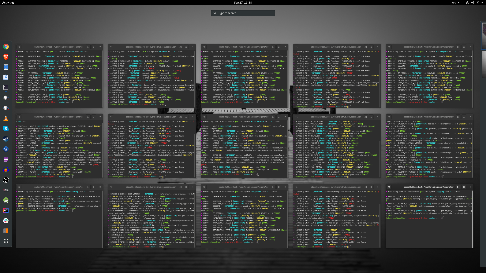

# Critical Systems Reconciliation

The puposes of CSR is to provide reconcilistion of the systems runtime 
configuration and associated resources. This is tested against an agreed
specification and known state of the system in question. This repository 
contains unit tests for the components which assemble these critical systems 
and which together make up a complete deployment of the cloud infrastructure, 
application platform and application. 



### Approach
Test coverage is the main priority of any CSR effort. Once the api has been
studied and the appropriate tool or tools have been selected the test cases
can be written. They should be coded in an atomised way so that they can be  
exported with minimal refactoring to another test runner and executed as 
part of a CI/CD process.

### Desgin goals
The test runner should adhere to the following design goals.
```
1. Execute a single unit test against a given system api.
2. Execute a suite of unit tests for a given system api.
4. Execute tests in parallel.
5. Exercise api's from both inside and outside of the cluster.
6. Produce machine-readable output for further processing.
```

### Prerequisites
Ensure you have access to the Google Cloud Platform and kubectl access to the
Google Kubernetes Engine.
```
1. Request IAM and confirm access.
2. Ensure all the tooling is configured accordingly.
```

Make sure your environment is configured for the project and cluster you are testing.
```
]$ gcloud config configurations list 
NAME           IS_ACTIVE  ACCOUNT             PROJECT        DEFAULT_ZONE  DEFAULT_REGION
default        False      user@gmail.com
dev            True       user@gmail.com      dev
uat            False      user@gmail.com      uat
prd            False      user@gmail.com      prd

]$ kubectx
dev
prd
```

### Tooling
Ensure you have the following tools installed. It's recommeded to have auto 
completion configured for these tools where possible. Please refer to the 
tooling pages for instructions on how to enable it. 
```
0. Bash
1. GIT
2. Gcloud
3. Kubectl
4. Kubectx
5. Kail
```

You should have login access to the following services.
```
1. https://github.com/xencon
2. https://console.cloud.google.com
```

### Test Execution
The csr-runner expects three flags for environment, system and unit test.
These options take a single argument respectively. 
```
[CSR-RUNNER]

Executes systems and unit tests for critical system reconciliation.

Examples:
  # Execute all unit tests for the gcp system.
  csr-runner -e dev -s gcp -u all

  # Execute the cluster_name unit test for the gcp system.
  csr-runner -e dev -s gcp -u cluster_name

Flags:
  -e target environment e.g. [dev]
  -s target system e.g. [gcp] or [ist]
  -u target test e.g. [project_id] or [cluster_name] etc...

Usage:
  csr-runner [flags] [args]
```

### Test creation
The unit tests are simple functions in the tests file under the unit folder for 
the relevant system. Check README.md for your system for details about the 
tests and how they exercise the relevant api.
```
├── dev			
│   ├── gcp
│   │   ├── assert.vars
│   │   ├── README.md
│   │   └── unit
│   │       └── tests
│   ├── ist
│   │   ├── assert.vars
│   │   ├── README.md
│   │   └── unit
│   │       └── tests
│   └── README.md
├── csr-runner
├── profile
└── README.md
```

### Assertions

Refer to the CSR spreadsheet, identify a test and update the `assert.vars` 
file for your system with the asserted value.
```
# Expected values  

# GCP CONFIGURATION
REGION="--region=europe-west2"
PROJECT_ID="my-project-id"

# GKE CONFIGURATION
CLUSTER_NAME="my-cluster"
CLUSTER_VERSION="1.13.7-gke.8"
PRIVATE_CLUSTER="True"
AUTOSCALING="True"
PRIVATE_NETWORK="A regional GKE cluster on a private network"
PREEMTIBLE="True"

# AUTH DATABASE
DATABASE_NAME="my-database"
DATABASE_VERSION="POSTGRES_9_6"
FAILOVER_REPLICA="True"
AVAILABILITY_TYPE="REGIONAL"
BACKUP_CONFIGURATION="True"
...
```

Update the `tests` file with your test by adding an entry to the suite of tests
at the top of the file and then copy the last test and update the values 
accorgingly. See the example test for more details.

### Test examples

These are simple bash tests evaluating the output of a systems api. This 
example queries the kubectl api to traverse the jsonpath associated with
the pod's configuration to retive the version number of the pod. The expected
result is contained in the assert.var file for the system and the actual 
result is tested against the asserted value via a bash variable evaluation.
```
all() {
all_in_one_version
citadel_version
...
}

all_in_one_version() {
  source ${PWD}/profile && source ${PWD}/cld/ist/assert.vars
  BOILER="${M}#${N} IST001 | CITADEL_VERSION |"
  ACTUAL="$(kubectl get pods -n istio-system -o jsonpath="{.items[*].spec.containers[*].image}" |tr -s '[[:space:]]' '\n' |sort |uniq | grep "all-in-one")"
  TEST="${EXPECTED} ${ALL_IN_ONE_VERSION} ${RESULT} ${ACTUAL}"
  if [[ ${ALL_IN_ONE_VERSION} == "${ACTUAL}" ]]; then echo "${BOILER} ${TEST} ${PASS}" ; else echo "${BOILER} ${TEST} ${FAIL}" ; fi
}

citadel_version() {
  source ${PWD}/profile && source ${PWD}/cld/ist/assert.vars
  BOILER="${M}#${N} IST001 | CITADEL_VERSION |"
  ACTUAL="$(kubectl get pods -n istio-system -o jsonpath="{.items[*].spec.containers[*].image}" |tr -s '[[:space:]]' '\n' |sort |uniq | grep "citadel")"
  TEST="${EXPECTED} ${CITADEL_VERSION} ${RESULT} ${ACTUAL}"
  if [[ ${CITADEL_VERSION} == "${ACTUAL}" ]]; then echo "${BOILER} ${TEST} ${PASS}" ; else echo "${BOILER} ${TEST} ${FAIL}" ; fi
}

...
```

### Test output
An example of a test output should adhere to following the convention for 
audit compliance.
```
[REFERANCE] [TEST NAME] [EXPECTED VALUE] [ACTUAL VALUE] [PASS/FAIL]
``` 

Real world examples take the following form. The output is colorised for usability.
```
]$ ./csr-runner -e dev -s ist -u all
# Executing test in environment dev for system ist unit all test:

# IST001 | CITADEL_VERSION | [EXPECTED] docker.io/jaegertracing/all-in-one:1.9 [RESULT] docker.io/jaegertracing/all-in-one:1.9 [PASS]
# IST001 | CITADEL_VERSION | [EXPECTED] docker.io/istio/citadel:1.2.4 [RESULT] docker.io/istio/citadel:1.2.2 [FAIL]
# IST001 | EGRESS_VERSION | [EXPECTED]  [RESULT] docker.io/istio/proxyv2:1.2.2 [FAIL]
# IST001 | GALLEY_VERSION | [EXPECTED] docker.io/istio/galley:1.2.4 [RESULT] docker.io/istio/galley:1.2.2 [FAIL]
# IST001 | GRAFANA_VERSION | [EXPECTED] grafana/grafana:6.1.6 [RESULT] grafana/grafana:6.1.6 [PASS]
# IST001 | INGRESS_VERSION | [EXPECTED]  [RESULT] docker.io/istio/proxyv2:1.2.2 [FAIL]
# IST001 | MIXER_VERSION | [EXPECTED] docker.io/istio/mixer:1.2.4 [RESULT] docker.io/istio/mixer:1.2.2 [FAIL]
# IST001 | NODE_AGENT_VERSION | [EXPECTED] docker.io/istio/node-agent-k8s:1.2.4 [RESULT] docker.io/istio/node-agent-k8s:1.2.2 [FAIL]
# IST001 | PILOT_VERSION | [EXPECTED] docker.io/istio/pilot:1.2.4 [RESULT] docker.io/istio/pilot:1.2.2 [FAIL]
# IST001 | PROMETHEUS_VERSION | [EXPECTED] docker.io/prom/prometheus:v2.8.0 [RESULT] docker.io/prom/prometheus:v2.8.0 [PASS]
# IST001 | QUAY_VERSION | [EXPECTED] quay.io/kiali/kiali:v0.20 [RESULT] quay.io/kiali/kiali:v0.20 [PASS]
# IST001 | SIDECAR_VERSION | [EXPECTED] docker.io/istio/sidecar_injector:1.2.4 [RESULT] docker.io/istio/sidecar_injector:1.2.2 [FAIL]
```
